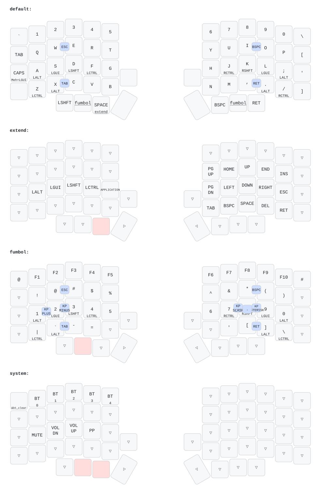

# kenkyo-zmk-config

A ZMK firmware config for a `nice_nano_v2` + `lily58` split board, combining:

- The build plumbing, home-row-mod infrastructure, and OLED/battery setup
  from [`daer68/silakka54-zmk-config`](https://github.com/daer68/silakka54-zmk-config).
- The layout design from **[Kenkyo](https://github.com/argenkiwi/kenkyo)**:
  home/bottom-row mods, one-key chords, the `extend` (navigation/media) layer,
  and the `fumbol` (numbers/function-keys/symbols) layer.

## Layout



Regenerated automatically on every push by
[`.github/workflows/draw-keymap.yml`](.github/workflows/draw-keymap.yml)
(via [keymap-drawer](https://github.com/caksoylar/keymap-drawer)). To
regenerate it locally after editing the keymap: `./draw.sh`.

## What's different from both sources

- Only 3 of lily58's 4 thumb keys per hand physically exist on this board
  (the innermost one on each hand, `LH0`/`RH0`, doesn't) — those are bound
  to `&none`. Thumb row, left to right: (unbound), Shift, Extend | Fumbol,
  Space, (unbound) — `Extend` and `Fumbol` are plain momentary-layer keys,
  not tap/hold. Backspace and Enter aren't on the thumb cluster at all;
  they're only reachable via their one-key chords (see below).
- A new `system` layer activates when `extend` and `fumbol` are held
  together (same tri-layer trick the old config used for `sys`). It carries
  bluetooth profile controls and media keys (see Layers below).
- Kenkyo's one-shot modifier chords (space-anchored and multi-modifier) are
  intentionally not ported.
- No AltGr anywhere — every spot Kenkyo used right-Alt uses regular Alt
  instead.

## Layers

- **default** — QWERTY with home/bottom-row mods (Alt/Gui/Shift/Ctrl on
  `A S D F` / `J K L ;`, Ctrl/Alt on `Z X` / `. /`), one-key chords
  `W+E`→Esc, `I+O`→Backspace, `X+C`→Tab, `,+.`→Enter (also active on
  `extend` and `fumbol`), and a Caps Lock/Hyper key (tap/hold) on the
  leftmost home-row position. The rightmost column (top to bottom:
  `\ [ ' ]`) and top-left corner (`` ` ``) are plain ASCII hosts for the
  OS's Russian layout to remap by physical position.
- **extend** — navigation (arrows, Home/End/PgUp/PgDn/Ins) on the QWERTY
  row, plain modifier taps on the home row plus Tab (`T`), Enter (`G`),
  and Menu (`B`), and Backspace/Space/Delete on the bottom row.
- **fumbol** — `F1`–`F12` straight across the number row, shift+number
  symbols one row below that, numbers on the home row (still mod-tapped),
  and math chords (`S+D`→`-`, `D+F`→`+`, `J+K`→`/`, `K+L`→`*`,
  `J+L`→`.`).
- **system** — bluetooth profile selection (`BT_SEL 0-4`, number row) and a
  3-second hold to clear the current profile's bond, plus media keys
  (mute/volume/play-pause) on the home row.

## Building

One-time toolchain setup (west, Python deps, Zephyr SDK), then:

```sh
west init -l config
west update
```

From then on, `./build.sh` builds both halves and drops the firmware into
`install/` (`./build.sh --pristine` for a clean reconfigure). Or push to
GitHub and let `.github/workflows/build.yml` build both halves as CI
artifacts instead.

## Credits

The `extend`/`fumbol` layer design and one-key chords are adapted from
**[Kenkyo](https://github.com/argenkiwi/kenkyo)**, a minimal 31-key layered
layout by [argenkiwi](https://github.com/argenkiwi). This repo only ports
that design onto different (split, `lily58`) hardware with different
thumb-key wiring and a new `fn` layer — all credit for the underlying layout
goes to the original project. Go check it out.

## License

MIT — see [LICENSE](LICENSE).
